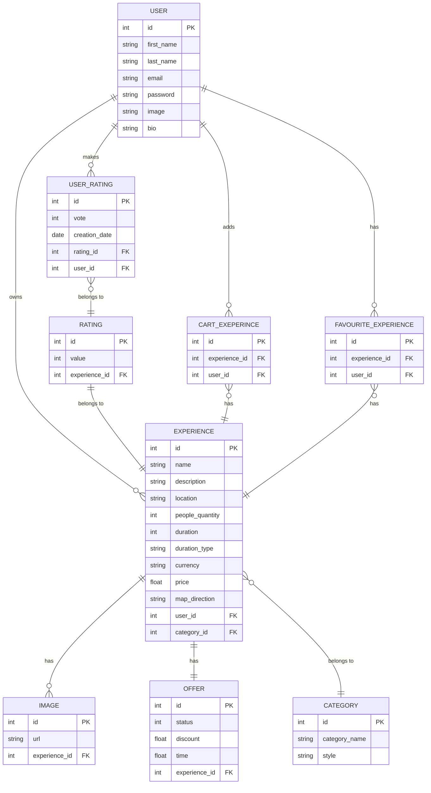

# GoodTrail
## Tabla de contenidos 
1. [Instalación y configuración](#install)
2. [Corriendo el proyecto](#running) 
3. [GoodTrail](#goodTrail)
4. [¿Quiénes somos?](#quienesSomos)
5. [Referentes del mercado](#links)
6. [Tablero de trabajo](#trello)
7. [Diagrama de Entidad-Relación](#der)
8. [Tabla de Dayli](#dayli)

## Instalación y configuración <a name="install"></a>
Instalar los modulos requeridos con el siguiente comando: 

```console
$ npm install
```

Es necesario tener una clave para la API de Google Maps y crear un archivo .env en la raíz del proyecto. El mismo debe contener la siguiente variable de entorno: 

```console
GOOGLE_MAPS_KEY = <Key de Google Maps>
```

Asignarle a la variable de entorno la Key de la API.

## Corriendo el proyecto <a name="running"></a>

```console
$ npm start
```

## ¿Qué es GoodTrail? <a name="goodTrail"></a>
GoodTrail es un e-commerce/marketplace donde un usuario podrá buscar y comprar experiencias.

### ¿Qué es una experiencia? 
Una experiencia podrá ser desde un viaje a cualquier lugar del mundo, hasta una salida al cine más cercano. Algunos ejemplos de experiencias: 
* Eventos deportivos
* Viajes al exterior
* Cenas 
* Entradas al cine/teatro 
* Estadías en hoteles
* Aventuras 

### Publico objetivo
GoodTrail es para todo amante de la aventura y el disfrute. Cualquier persona que desee disfrutar de experiencias únicas y generar recuerdos para toda la vida.    

Inicialmente un usuario solo podrá comprar experiencias que se encuentren disponibles (e-commerce), pero el objetivo es que los usuarios puedan ofrecer experiencias.

## ¿Quiénes somos? <a name="quienesSomos"></a>
Somos cuatro estudiantes de DH en el curso Programación Web Full Stack.

### Lucrecia Rios
Mi nombre es Lucrecia Rios, tengo 18 años. Soy de Córdoba, me gusta el deporte y pasar tiempo con mi familia, juego al fútbol hace 5 años, ahora que termine el secundario empecé a trabajar en un kiosco, no me imaginaba estar estudiando esto por eso fue muy raro tomar esta decisión de estudiar en DH ya que nunca fui muy fan de la computación, pero de todos modos estoy contenta ya que es un nuevo desafío.

### Gabriel Tettamanti

Yo soy Gabriel Tettamanti, nací en San Pedro provincia de Buenos Aires hace 22 años, estudié tres años de economía, soy apacionado del arte, los videojuegos y el deporte.

### Ignacio Lopez
Mi nombre es Ignacio Lopez, tengo 23 año, soy de la ciudad de Avellaneda y estudiante de ingeniería informática. Apasionado por la tecnología desde chico ya hace años que estudio informática y siempre busco aprender cosas nuevas para seguir mejorando. Me gusta mucho los deportes, el cine y los libros. 

### Julian Blazquez
Mi nombre es Julian Blazquez, tengo 18 años y soy de Coghlan CABA. Soy actual estudiante de economía en la UBA. Me gusta salir a correr y los deportes en general. Nunca entendí mucho de todo lo relacionado a la tecnología pero me pareció interesante hacer este curso para tener nuevas herramientas y para darle una oportunidad a algo que creo que me puede llegar a gustar.

## Referentes del mercado <a name="links"></a>
### BigBox 
https://www.bigbox.com.ar/

BigBox ofrece experiencias. Cada usuario puede comprar para sí mismo o como regalo un paquete de una experiencia. Dentro de ese paquete, el usuario puede seleccionar una de las muchas opciones que son ofrecidas.

### Mercado Libre
 https://www.mercadolibre.com.ar/

No hay mucho que contar sobre Mercado Libre que no sea de público conocimiento. Elegimos el sitio por la estética y funcionalidad del carrito de compras.

### Netflix 
https://www.netflix.com/ar/login

Pionero de la industria del streaming. Elegimos el sitio por la configuración de la cuenta de usuario.

### Sotheby´s International Realty
https://www.sothebysrealty.com/spa

Una de las inmobiliarias más importantes del mundo. 
Elegimos el sitio por la estética y funcionalidad de la descripción de los productos.
 
### Twitch
https://www.twitch.tv/
    
Uno de los sitios webs más importantes de los últimos años. Fue elegido por la estética y funcionalidad que presentan las pantallas de Login y Registración de usuario. Al no redirigirnos a otra pantalla, creemos que presenta una funcionalidad muy user-friendly.

## Tablero <a name="trello"></a>
https://trello.com/b/6FLmuyJn/goodtrail

## Base de datos <a name="der"></a>


## Tabla de Dayli <a name="dayli"></a>

### Sprint 7

| **Fecha** | **Nombre** | **Que hice** | **Que voy hacer** | **Tendré dificultades con** |
| --- | --- | --- | --- | --- |
| 27/07 | Ignacio | Hicimos entre todos la tabla del dayli | Estudiar Redes para mañana | VOIP |
| 29/07 | Gabriel e Ignacio | Hicimos que no se pueda repetir email al registrarse e hicimos el servicio de creacion de usuario |  |  |
| 29/07 | Gabriel, Ignacio y Lucrecia | Llevamos a cabo la weekly, dividimos tareas y decimos cómo trabajar en los siguientes días | Validaciones de formularios en el front y backend y modulaciones | --- |
| 29/07 | Ignacio | Cree el Dropdown-menu del usuario y el archivo de JS para que sea dinamico | Mañana mejoro el estilo del mismo |  |
| 29/07 | Ignacio | Estilos del Dropdown-menu del usuario | Mañana ya arranco con el paginado del catalogo |  |
| 30/07 | Gabriel | Pense como trabajar en mis tareas. | Voy a pasar todas los contactos entre el userController y la db al UserService. | Puede que se me complique iplementarlo por falta de experiencia. |
| 30/07 | Ignacio | Implemente el paginado del catalogo de experiencias | Parece andar correctamente pero voy a insertar más experiencias en la DB para corroborar |  |
| 31/07 | Gabriel | Pasando los metodos que comunican el userController y la db a los serveces. | Seguir con los services. | Trato de terminarlo hoy. |
| 02/08 | Gabriel | Termine de revisar los user.services | Voy a hacer las validaciones del registro de usuarios en el backend | Falta de practica |
| 02/08 | Ignacio | Validaciones de la experiencia en el back y agrego 1 experiencia a la DB | Tengo que revisar que valide bien el tipo de imagen al crear la experiencia | Falta de tiempo |
| 04/08 | Gabriel | Revise el codigo de validacion de email. | Voy a avanzar con las validaciones del front en el registro de formulario. Espero terminar con el nombre. | Puedo tener dificultades con los condicionales y la logica que uso para poner el HTML desde JS |
| 05/08 | Gabriel | Validaciones de registro de usuario en el front | Voy a hacer la validacion de la password | Puedo tener dificultad en la comprobacion de la contraseña |